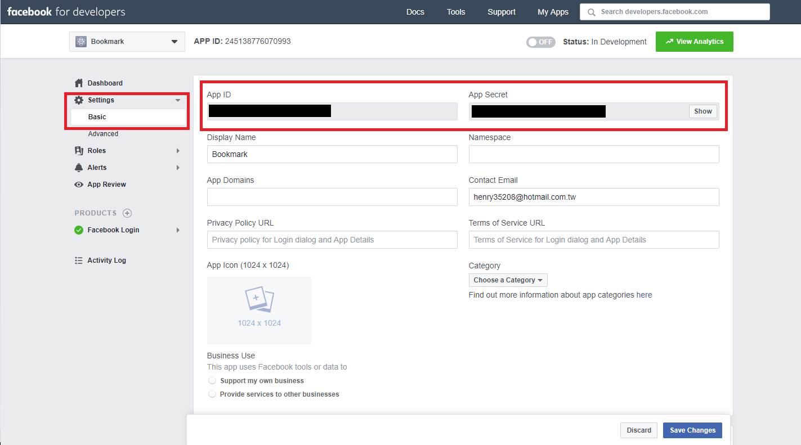

# Sign-in with third-party account

In this section, you will learn how to sign-in Bookmark service with third-party accout.

The third-party we will guide here include:

- google
- facebook

## Sign-in with Google

1. Navigate to [Google API Console](https://console.cloud.google.com/apis/).

2. New project

    

3. Set Project name

    Set `Project Name` & `Location` then press `CREATE`

4. View OAuth client Credentials

    Select `Credentials` in the left navigation bar and click `OAuth client`.

    

5. Set project's `Client ID` & `Client Secret` to Bookmark configs

    The new project's `Client ID` & `Client Secret` will list on the top. You'll need to fill these two content to `config.auth.google.clientID` & `config.auth.google.clientSecret`, which is located in `configs/index.js`.

    

6. Set `Authorised JavaScript origins`

    Set it as your website URI. If you don't have a domain yet, set it as:

    ```url
    http://localhost:3000
    ```

    **Note:** `Authorised JavaScript origins` cannot contain a wildcard (`https://*.example.com`) or a path (`https://example.com/subdir`)

7. Set `Authorised redirect URIs`

    Set it as your website URI. If you don't have a domain yet, set it as:

    ```url
    http://localhost:3000/api/auth/google/callback
    ```

8. Click `Save`

    

9. Enable Google+ apis and services

    Select `Dashboard` in the left navigation bar and click `ENABLE APIS AND SERVICES`.

    

    Then select Google+ API and Enable it.

    

## Sign-in with Facebook

1. Navigate to [Facebook for Developers](https://developers.facebook.com/)

2. New project

    

3. Set Project name

    Set `Display Name` & `Contact Email` then press `Create App ID`

4. View OAuth client Credentials

    Select `Setting` -> `Basic` in the left navigation bar.

5. Set project's `Client ID` & `Client Secret` to Bookmark configs

    The new project's `Client ID` & `Client Secret` will list on the top. You'll need to fill these two content to `config.auth.google.clientID` & `config.auth.google.clientSecret`, which is located in `configs/index.js`.

    

6. Set `Share Redirect Whitelist`

    Select `Setting` -> `Advanced` in the left navigation bar.

    You will see `Share Redirect Whitelist` at the bottom of the page. Set it as your website URI. If you don't have a domain yet, set it as:

    ```url
    http://localhost:3000/api/auth/facebook/callback
    ```

    

7. Click `Save Changes`
